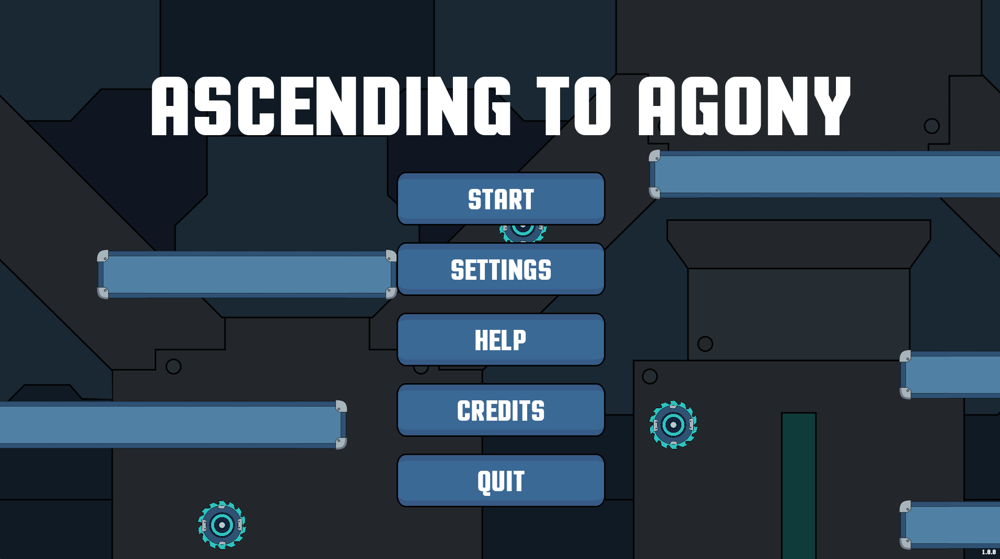

# Ascending To Agony

A 2D physics-based platformer where you shoot bullets to propel yourself through a hazard-filled level.



## Gameplay Demo

https://github.com/user-attachments/assets/gameplay-video.mp4

## Overview

**Ascending To Agony** is a challenging 2D platformer inspired by the "Getting Over It" genre. Players must navigate a dangerous environment to reach the goal at the top of the map using a unique movement mechanic: shooting bullets in one direction propels you in the opposite direction. Master momentum and precision to survive turrets, rotating saws, spike traps, and other deadly obstacles.

## Features

- **Physics-Based Movement** - Shoot bullets to control your momentum and navigate the level
- **Bullet Management** - Limited ammunition that regenerates when grounded and stationary
- **Developer Terminal** - Runtime debugging console with commands to modify gameplay parameters
- **Hazardous Environments** - Turrets, rotating saws, spike traps, and pressure plates
- **Customizable Settings** - Adjustable audio, display, and developer options

## Requirements

- **Godot Engine** 4.5 or later
- **.NET SDK** 8.0 or later

## Running the Game

1. Open the project in Godot Editor 4.5
2. Click the play button
3. The game will start from `GameLoadScene.tscn`

> **Note:** Audio assets have been excluded from this repository to respect licensing restrictions. The game is fully functional without them, though sound effects and music will not play.

## Controls

- **Left Mouse Button** - Shoot bullets (movement)
- **Shift + Tab** - Toggle developer terminal (if enabled in settings)
- **W/S** - Navigate terminal command history (when terminal is open)

## Project Structure

```
Scenes/           - Game scenes (menus, levels, player, entities)
Scripts/          - C# game logic
Assets/           - Handmade SVG Sprites, textures, and visual assets
Sounds/           - Audio files
Fonts/            - Custom fonts
Themes/           - UI theme resources
Tilesets/         - Tileset resources
Media/            - Screenshot and gameplay video for documentation
```

## Developer Terminal

Enable the developer terminal in settings to access runtime commands:

- `setmaxspeed <value>` - Adjust player max speed
- `setmass <value>` - Modify player mass
- `setgravity <value>` - Change gravity scale
- `setposition <x> <y>` - Teleport player
- `toggleinv` - Toggle invincibility

See `Terminal.cs` for complete command list.

## License

This project is source-available for viewing and educational purposes only.

All rights reserved. You may view and study the code, but you may not use, copy, modify, or distribute this software or any portion of it without explicit written permission.

Copyright © 2025 Collin Niemela
